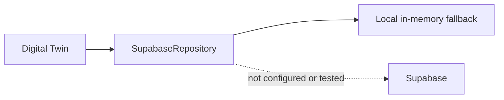

# Local Integration Audit

## 1. Component Presence

### Inventory

| Component | Path | Exists | Importable | Runtime Tested |
|---|---|---:|---:|---:|
| Digital Twin main | `python/main.py` | Yes | Yes as `python.main` | Yes (the requested script invocation failed; Uvicorn entrypoint succeeded) |
| Digital Twin server | `python/server.py` | Yes | Yes | Yes |
| TraCI controller | `python/traci_controller.py` | Yes | Yes | Yes |
| Traffic light manager | `python/traffic_light_manager.py` | Yes | Yes | Yes |
| Scenario manager | `python/scenario_manager.py` | Yes | Yes | Yes |
| Metrics collector | `python/metrics_collector.py` | Yes | Yes | Yes |
| Network exporter | `python/network_exporter.py` | Yes | Yes | Yes |
| Config | `python/config.py` | Yes | Yes | Yes |
| Integration package | `python/integration/__init__.py` | Yes | Yes | Yes |
| Integration schemas | `python/integration/schemas.py` | Yes | Yes | Yes |
| ID mapper | `python/integration/id_mapper.py` | Yes | Yes | Yes |
| Local/cloud repository | `python/integration/supabase_repository.py` | Yes | Yes | Yes (local in-memory mode only) |
| Quantum client | `python/integration/quantum_client.py` | Yes | Yes | Yes (HTTP and API-offline paths) |
| Quantum/SUMO adapter | `python/integration/quantum_sumo_adapter.py` | Yes | Yes | Yes |
| Job manager | `python/integration/job_manager.py` | Yes | Yes | Yes |
| SUMO network | `sumo/network.net.xml` | Yes | n/a | Yes |
| SUMO nodes | `sumo/network.nod.xml` | Yes | n/a | Yes |
| SUMO edges | `sumo/network.edg.xml` | Yes | n/a | Yes |
| SUMO additional assets | `sumo/additional.add.xml` | Yes | n/a | Yes |
| Normal Day config | `sumo/normal_day.sumocfg` | Yes | n/a | Yes |
| Event Day config | `sumo/event_day.sumocfg` | Yes | n/a | Yes |
| Frontend page | `ui/index.html` | Yes | n/a | Yes (served and rendered) |
| Frontend stylesheet | `ui/css/style.css` | Yes | n/a | Yes (loaded in browser) |
| Frontend app | `ui/js/app.js` | Yes | n/a | Yes (WebSocket connected; telemetry HUD stale) |
| Frontend controls | `ui/js/controls.js` | Yes | n/a | Yes (loaded in browser) |
| Three.js renderer | `ui/js/renderer3d.js` | Yes | n/a | Partial (scene rendered; live-state display incomplete) |
| Integration test | `tests/test_quantum_digital_twin_integration.py` | Yes | Yes | Yes |
| Live SUMO test | `tests/test_e2e_sumo_quantum_live.py` | Yes | Yes | Yes |
| Test runner | `run_test_runner.py` | Yes | Yes | Yes |
| Quantum API | `quantum_module/Quantum-main/api/main.py` | Yes | Yes | Yes |
| QUBO builder | `quantum_module/Quantum-main/optimization/qubo_builder.py` | Yes | Yes | Yes |
| QAOA solver | `quantum_module/Quantum-main/optimization/qaoa_solver.py` | Yes | Yes | Yes |
| Classical optimizer | `quantum_module/Quantum-main/optimization/classical_optimizer.py` | Yes | Yes | Yes |
| Interaction builder | `quantum_module/Quantum-main/optimization/interaction_builder.py` | Yes | Yes | Yes (used by QUBO builder) |
| Decision variables | `quantum_module/Quantum-main/optimization/decision_variables.py` | Yes | Yes | Yes |
| Traffic decision engine | `quantum_module/Quantum-main/optimization/traffic_decision_engine.py` | Yes | Yes | Yes |
| SUMO exporter | `quantum_module/Quantum-main/optimization/sumo_exporter.py` | Yes | Yes | Yes |
| Final plan artifact | `quantum_module/Quantum-main/results/final_traffic_plan.json` | Yes | n/a | Yes (found stale after API runs) |
| SUMO input artifact | `quantum_module/Quantum-main/results/sumo_input.json` | Yes | n/a | Yes |

### Python dependency/import check

All checked Digital Twin and integration modules imported successfully, including `python.server`, FastAPI, Pydantic, requests, httpx, TraCI, and sumolib. The Quantum API and all requested optimization modules imported successfully. `sumo`, `sumo-gui`, and `netconvert` were found on PATH. No dependency installation was needed.

## 2. Quantum Module

Status:
PASS

Evidence:

- Repository location: `D:\Work\Project\Traffic\quantum_module\Quantum-main`.
- Started with `python api\main.py` on port 8001.
- `GET /health` returned `healthy`, service `quantum_traffic_optimizer`, and `decision_variables: 18`.
- A real Event Day `POST /api/quantum/optimize` returned HTTP 200, `optimizer_used: Quantum`, a binary 18-bit string, corridors, signal changes, restrictions, benefits, runtime, `status: completed`, and `error: null`.
- Sequential request evidence: bitstring `110010000011110000`, Quantum API runtime `33.004 s` (client stopwatch elapsed about 33 s).
- An initial request failed with HTTP 500 because the sandbox denied writes to the Quantum repository’s normal generated files. After approval to run the existing API with access to those result artifacts, the same API completed. No Quantum source or algorithm was changed.

## 3. QUBO/QAOA Pipeline

Status:
PASS

Evidence:

- API source calls `build_qubo`, then `solve_qaoa` for `solver=qaoa`, then `build_plan` and `build_export`.
- `qubo_builder.py` imports and calls `interaction_builder.build_interaction_matrix`; the solver uses the existing 18-variable QUBO.
- The API log showed `Building Scenario-Aware QUBO`, `Converting QUBO to Ising`, `Running Grid Search QAOA`, and all 64 grid progress steps.
- `qaoa_solution.json` recorded 18 variables and an 18-bit result; its bitstring matched `sumo_input.json` after a sequential API request.
- Artifact consistency failed for `final_traffic_plan.json`: after the sequential result was `110010000011110000`, `qaoa_solution.json` and `sumo_input.json` had that bitstring, but `final_traffic_plan.json` remained `100100011100110000`. The API builds the plan in memory; the decision engine writes the plan file only when run as `__main__`.

## 4. SUMO/TraCI

Status:
PASS

Evidence:

- Event Day SUMO started via `TraCIController`; a paused live snapshot reported vehicles, seven traffic lights, and the network edges. After resuming, simulation time advanced and vehicle count increased.
- The controlled Quantum integration returned 23 commands, all targeting IDs present in the live network.
- Actual adapted travel-time values changed on 18 mapped edges from SUMO’s default `-1.0` to `16.0` after TraCI application.
- A separate offline-path live check measured current traffic light next-switch times changing (for example `J_CENTRAL_STAD` 36→42 seconds, `J_NE` 36→46 seconds, `J_SW` 36→43 seconds).
- The standard live SUMO test passed and logged 23/23 applied command calls. A SUMO socket-reset message appeared during test-runner shutdown; the runner still printed all its endpoint/WebSocket checks as passed.

## 5. Digital Twin Server

Status:
PARTIAL

Evidence:

- `python python\main.py` fails with `ImportError: attempted relative import with no known parent package` at `python/main.py:5`.
- The server itself starts successfully with `python -m uvicorn python.server:app --host 127.0.0.1 --port 8000` and starts the local simulation.
- Geometry, comparison, run listing, latest plan, and `/` returned HTTP 200. The server exposes `/api/integration/trigger_optimization`, `/api/integration/runs`, `/api/integration/latest_plan`, and `/ws/simulation`.
- The repository announced `LOCAL IN-MEMORY FALLBACK MODE`; no cloud behavior is claimed or tested.

## 6. Quantum → Digital Twin

Status:
PASS

Evidence:

- The Digital Twin’s `/api/integration/trigger_optimization` invoked `QuantumOptimizationClient` over HTTP to `http://127.0.0.1:8001/api/quantum/optimize`.
- Server logs captured real jobs that returned Quantum optimizer results and were validated/mapped. Two HTTP trigger requests during the browser run logged `17/17` and `22/22` command calls applied.
- A controlled run directly through the Job Manager returned real API bitstring `110011100001010000`, passed 18-bit validation, and generated valid live SUMO IDs.
- The Quantum API-offline client path also executed the local QAOA pipeline and generated a valid result, but its optimizer label failed the required fallback contract; details are in section 11.

## 7. Digital Twin → SUMO

Status:
PASS

Evidence:

- Quantum-to-Traffic mapping and TraCI adapter were exercised against live Event Day SUMO.
- Live route-weight and traffic-light next-switch changes were observed after execution; these are state changes, not merely generated commands.
- All targets in the controlled run existed in the connected SUMO network.
- Caveat: adapter reports command calls as applied even though its route/restriction handlers swallow per-command exceptions; the observed controlled run did independently show actual route and signal state changes.

## 8. WebSocket → Three.js

Status:
PARTIAL

Evidence:

- A real `/ws/simulation` client received geometry (60 edges, 3 polygons) and live Event Day frames (for example 260 vehicles, 141 pedestrians, seven traffic lights, 60 congestion edges; simulation time 437.5 s).
- The browser connected to the Digital Twin page, displayed the 3D road network, showed the LIVE WebSocket pill, and its optimizer HUD received the real Quantum optimizer and bitstring through WebSocket state.
- The browser’s telemetry HUD remained at zero vehicles/pedestrians, NORMAL DAY, and `SIM 00:00.0` while the server’s WebSocket frames showed Event Day and hundreds of vehicles at advancing simulation time. The browser console log could not be inspected through the available CUA browser interface. Frontend live telemetry/UI behavior is therefore not verified as passing.
- The frontend uses the Digital Twin endpoints and `/ws/simulation`; it does not call the Quantum API directly.

## 9. ID Mapping

Status:
PASS

Evidence:

All four corridors’ mapped edges and all J1–J10 mapped traffic-light IDs were checked against the live Event Day SUMO connection; every mapped SUMO ID existed.

| Quantum ID | Canonical ID | SUMO ID(s) | Exists in SUMO | Test |
|---|---|---|---:|---|
| Anna Salai | `corridor_mount_road` | `E_WEST_IN_N`, `E_WEST_1`, `E_WEST_OUT_S`, `E_WEST_IN_S`, `E_WEST_1_rev`, `E_WEST_OUT_N` | Yes | PASS |
| Wallajah Road | `corridor_wallajah` | `E_NORTH_IN_W`, `E_NORTH_1`, `E_NORTH_2`, `E_NORTH_OUT_E`, `E_NORTH_IN_E`, `E_NORTH_2_rev`, `E_NORTH_1_rev`, `E_NORTH_OUT_W` | Yes | PASS |
| Kamarajar Salai | `corridor_kamarajar_salai` | `E_EAST_IN_N`, `E_EAST_1`, `E_EAST_OUT_S`, `E_EAST_IN_S`, `E_EAST_1_rev`, `E_EAST_OUT_N` | Yes | PASS |
| Triplicane High Road | `corridor_triplicane` | `E_SOUTH_IN_W`, `E_SOUTH_1`, `E_SOUTH_2`, `E_SOUTH_OUT_E`, `E_CENTRAL_1`, `E_CENTRAL_2`, `E_SOUTH_IN_E`, `E_SOUTH_2_rev`, `E_SOUTH_1_rev`, `E_SOUTH_OUT_W`, `E_CENTRAL_2_rev`, `E_CENTRAL_1_rev` | Yes | PASS |
| J1 | `junction_nw` | `J_NW` | Yes | PASS |
| J2 | `junction_n_central` | `J_N_CENTRAL` | Yes | PASS |
| J3 | `junction_ne` | `J_NE` | Yes | PASS |
| J4 | `junction_central_stad` | `J_CENTRAL_STAD` | Yes | PASS |
| J5 | `junction_sw` | `J_SW` | Yes | PASS |
| J6 | `junction_s_central` | `J_S_CENTRAL` | Yes | PASS |
| J7 | `junction_se` | `J_SE` | Yes | PASS |
| J8 | `junction_peripheral_north` | `J_NW` | Yes | PASS |
| J9 | `junction_peripheral_east` | `J_NE` | Yes | PASS |
| J10 | `junction_peripheral_south` | `J_SE` | Yes | PASS |

## 10. Idempotency

Status:
PARTIAL

Evidence:

- Reapplying the same completed local `run_id` returned `{"status":"skipped","reason":"already_applied"}`; measured signal state was unchanged on repeat.
- Request-level idempotency using the same `message_id` is not implemented by the Digital Twin trigger path: the endpoint creates a fresh UUID in `OptimizationJobManager`, and the job manager does not accept a caller-supplied message ID. The SQL schema’s uniqueness constraint is not exercised in local-memory mode. Two separate triggers generated separate runs and both applied.

## 11. Failure Fallback

Status:
FAIL

Evidence:

- With the API stopped, the Digital Twin client completed an in-process QAOA run, produced a valid 18-bit result, and applied it to live SUMO.
- It reported `optimizer_used: Quantum (In-Process QAOA)`, not the required `Classical (Fallback)`. It therefore did not satisfy the requested failure-fallback contract, although the local optimization succeeded.
- Restarted the standalone API; `/health` again returned `healthy` with 18 decision variables.

## 12. Test Results

| Test | Result | Runtime | Evidence |
|---|---|---:|---|
| Component/import checks | PASS | <1 s | All required Python imports succeeded; `sumo`, `sumo-gui`, and `netconvert` found. |
| Quantum API health | PASS | <1 s | HTTP 200; healthy; 18 variables. |
| Quantum API Event Day QAOA | PASS | 20.757 s and 33.004 s | Two real HTTP 200 optimization responses; one sequential response bitstring `110010000011110000`. |
| QUBO/QAOA pipeline | PASS | included above | 18-variable QUBO and QAOA grid-search logs; 18-bit persisted solution. |
| Quantum artifact consistency | FAIL | <1 s | `final_traffic_plan.json` stale versus matching current QAOA/SUMO export. |
| Live Quantum → SUMO TraCI | PASS | 28.9 s optimization | 23 commands; 18 edge route weights observed changed; actual TLS timing separately observed in fallback run. |
| SUMO Event Day / TraCI | PASS | 1–2 s startup | Live vehicle, TLS, edge counts; simulation advanced. |
| Offline API fallback label | FAIL | 31.73 s | Result was `Quantum (In-Process QAOA)`, not `Classical (Fallback)`; result was applied. |
| Duplicate same run application | PASS | <1 s | Repeat skipped as `already_applied`; TLS state unchanged. |
| Repeated same message ID request | FAIL / unsupported | n/a | Trigger path always creates a new message ID; duplicate requests can run and apply again. |
| Invalid 17-bit result | PASS | <1 s | Pydantic validation rejected it. |
| Invalid 19-bit result | PASS | <1 s | Pydantic validation rejected it. |
| Non-binary result | PASS | <1 s | Pydantic validation rejected it. |
| Unknown corridor | FAIL | <1 s | Mapper logged a warning and returned zero commands instead of raising validation failure. |
| Unknown junction | FAIL | <1 s | Mapper logged a warning and returned zero commands instead of raising validation failure. |
| Malformed response schema | PASS | <1 s | Pydantic rejected a response with a non-numeric benefit. A malformed live HTTP response was not injected. |
| `tests/test_quantum_digital_twin_integration.py` | PASS | 3.751 s | 8 tests, OK; repository used local in-memory mode. |
| `tests/test_e2e_sumo_quantum_live.py` | PASS | 5.559 s | Live Event Day SUMO, optimization, application, local repo check, and same-run skip. |
| `run_test_runner.py` | PASS with shutdown warning | ~15 s | REST, UI, WebSocket, and controls printed PASS; SUMO emitted socket-reset on teardown. |
| Browser Three.js runtime | PARTIAL | n/a | Dashboard rendered scene and optimizer HUD; telemetry HUD stayed stale. |
| Supabase | NOT TESTED | n/a | Explicitly out of scope; credentials are not configured. |

## 13. VERIFIED LOCAL DATA FLOW

### Control flow

```mermaid
flowchart LR
  SUMO[Event Day SUMO] --> TRACI[TraCIController]
  TRACI --> DT[Digital Twin Server]
  DT --> JOB[Optimization Job Manager]
  JOB --> CLIENT[QuantumOptimizationClient HTTP]
  CLIENT --> QAPI[Quantum API :8001]
  QAPI --> QUBO[18-variable QUBO / QAOA]
  QUBO --> PLAN[Traffic decision plan]
  PLAN --> VALID[18-bit response validation]
  VALID --> MAP[Quantum ID mapping]
  MAP --> ADAPTER[TraCIAdapter]
  ADAPTER --> SUMO
```



Verified through real API responses, logs, live SUMO target ID checks, changed edge route weights, and changed traffic-light next-switch times. Request-level duplicate suppression and required classical fallback labeling are not verified as passing.

### Visualization flow

```mermaid
flowchart LR
  SUMO --> TRACI[TraCIController snapshot]
  TRACI --> SERVER[Digital Twin Server]
  SERVER --> WS[/ws/simulation]
  WS --> APP[ui/js/app.js]
  APP --> THREE[renderer3d.js / Three.js]
```

The socket delivered live simulation data and the browser rendered the network and Quantum HUD. The live telemetry HUD did not reflect those server values, so the full visualization flow is only partially verified.

### Persistence flow



Local repository tests passed in process. Restart persistence and cloud persistence were not verified; local in-memory records are volatile.

## 14. BLOCKERS

- `python python\main.py` cannot start because `python/main.py` uses a relative import without package context. The Uvicorn module command works.
- The API does not refresh `results/final_traffic_plan.json` during a request; the artifact remains stale while `sumo_input.json` reflects the current run.
- API-offline execution reports `Quantum (In-Process QAOA)` rather than `Classical (Fallback)`.
- Digital Twin run creation does not accept/deduplicate caller `message_id`; two repeated triggers can apply independently.
- Unknown corridor and junction IDs are silently skipped after a warning rather than failing validation.
- The browser telemetry HUD remains stale despite the live WebSocket carrying current state.

## 15. REQUIRED FIXES

- Fix the Digital Twin main entrypoint import/start command.
- Persist the current decision plan consistently with each API response and SUMO export.
- Make API-offline behavior and its `optimizer_used` label match the required classical fallback contract, without changing the QUBO/QAOA formulation.
- Carry `message_id` through the trigger/job flow and deduplicate before running/applying.
- Reject unknown corridor and junction IDs before creating TraCI commands.
- Correct or diagnose frontend state handling so the clock, scenario badge, and live telemetry HUD reflect WebSocket snapshots; then inspect browser console errors.

## 16. FINAL LOCAL STATUS

PARTIALLY INTEGRATED LOCALLY
